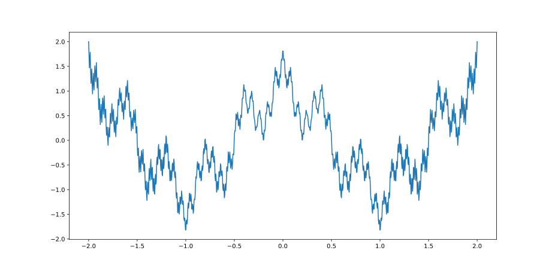

# Weierstrass-function
 Weierstrass function is an example of a real-valued function that is continuous everywhere but differentiable nowhere. It is an example of a fractal curve. It is named after its discoverer Karl Weierstrass.

Plot of Weierstrass function over the interval [−2, 2]. Like other fractals, the function exhibits self-similarity

